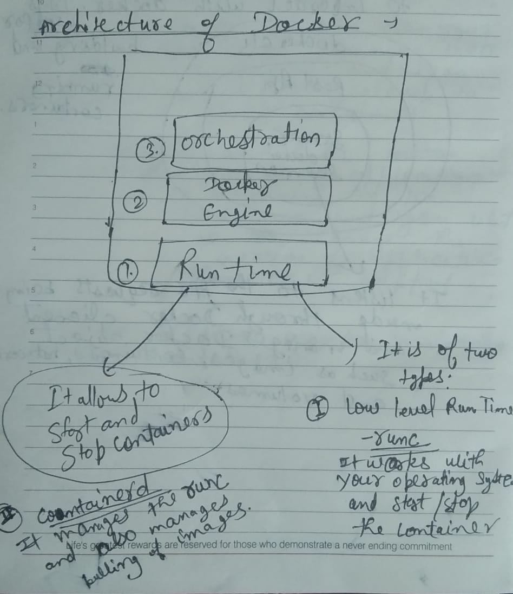
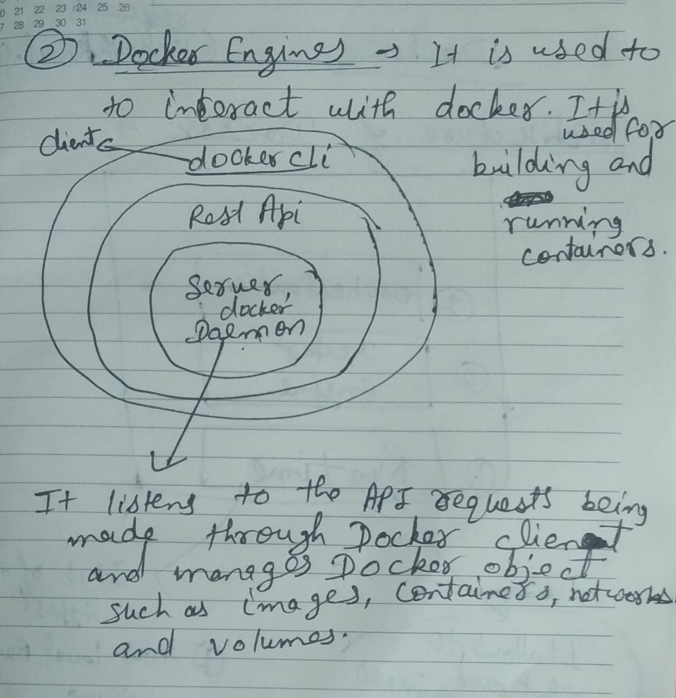
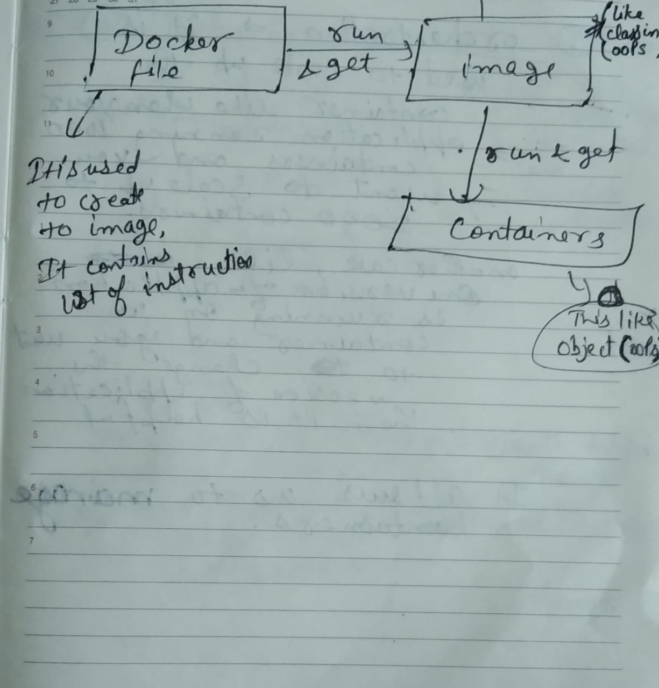
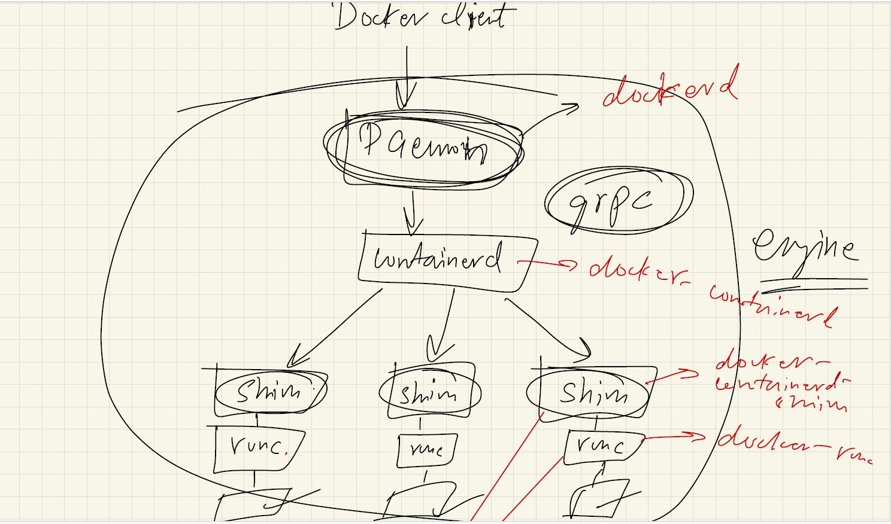

In old days(Before Docker), only one application is running on server.
<br>
IBM solves this problem by creating virtual machine. This machine allows multiple applications on the same server. But there was a problem that we need to download different os for different application in virtual machine.
And another problem is dependency problems.
<br>
Read more about Container and Docker:
https://www.techwithkunal.com/blog/getting-started-with-docker
<br>

# Containers

Containers allows multiple application to run on the same os inside containers using container engine.
<br>
Container itself is an isolated environment.  
<br>
Download docker : https://docs.docker.com
<br>

# Archietecture of Docker :


<br>

<br>


# About Docker


<br>
As there are many container runtime like runc,containerd and many more.So we are confused that we should use. 
<br>
For this there is a solution that is called "Open Container Intiative"
<br>
It is basically a project under the linux foundation.
<br>
The Open Container Initiative is an open governance structure for the express purpose of creating open industry standards around container formats and runtimes.
<br>
The OCI currently contains three specifications: the Runtime Specification (runtime-spec), the Image Specification (image-spec) and the Distribution Specification (distribution-spec)
<br>
OCI Runtime Specification : It defines how a container is started and run (e.g., runc, containerd).
<br>
OCI Image Specification : It  defines the format of container images (e.g., Docker and Podman images).
<br>
Distribution Specification : The OCI Distribution Specification defines how container images are stored, retrieved, and distributed across different container registries. It is based on Docker's registry HTTP API V2 and ensures interoperability between different container image registries.
<br>
A container registry is a centralized repository where container images are stored, managed, and distributed. like : docker-hub
<br>
Interoperability : It allows different tools (e.g., Docker, Podman, containerd) to interact with OCI-compliant registries.
<br>
Read more at : https://opencontainers.org/about/overview/

# About Docker Basic Commands :

Dockers is an isolated environment in which we are running images in the container.
<br>
An docker image also contains the smaller version of os which is used to run the main application we want to run.
<br>
Learn more about Docker Commands :
<br>
https://www.geeksforgeeks.org/docker-instruction-commands/
<br>

```bash

docker run -it ubuntu

-it: It is short form of interactive which means don't exit out from it.


# when we write commands like :
"docker container exec -it <containerID> bash"


It means bash is attached to that container.


# This commands only works when the specific container is running.
"docker container prune -f": It will delete all the stopped containers.


# Alpine Images : The Alpine Linux image is a minimal, security-oriented, and lightweight Linux distribution.
# It's commonly used in Docker images because of its small size and efficient nature.


# Once we have pulled this image we can use the Linux based commands.


# When we want to run an image in the background then we can run in the detatch mode :
"docker run -d alpine ping www.google.com"
Here after alpine "ping www.google.com" will go to the alpine terminal to execute it.


# Any image that is running in docker container for that container base is linux kernel.


command : "docker run -d -p 8080:80 nginx"

Here, this commands means forwards all the request to the "localhost://8080" that we are making on the containers port 80.

Here, -p means publish

This command runs the nginx server 


# We can find the logs of all the container by their id.
"docker logs <first four numbers or complete containerId >"


# we can also find the logs of last n seconds:
"docker logs --since 5s <containerID>"

# We can also check the live logs on the terminal by :
"docker attach <container ID>"
this commands attach the container terminal to our terminal shows all the live logs.

# we can remove all the images by using commands :
docker rmi (docker images -q)


# we can also use the mysql in the docker 
For this  : first of all we need to pull the "mysql" image . 

docker pull mysql 

Then run the mysql :

docker run  -e MYSQL_ROOT_PASSWORD='root' mysql 

Here -e means an environment variable which is used to store the mysql password.
As mysql is database so we need to pass the password to run the mysql. 

We can also run the mysql in the detached mode(In the background). 

Once the mysql is running in the detached mode we can enter into the mysql container by run the command : 

docker exec -it "ContainerID or image-name" bash 

After running this command : a bash shell will be visible. 

# Then by entering the username and password we can enter into it. 
mysql -u root -p 

# Then enter password : 

# Then we can use msyql.  

# We can exit from any bash shell or mysql by running command :
exit 


# We can rename the docker images 
docker image tag myImage:latest rupeshkumar4511/myImage:latest 

```

<br>

# How to create our own images :

```bash

1. First of all create a file named Dockerfile.

2. Write some code like :

FROM ubuntu
CMD ["echo", "Hello world"]

// Here ubuntu is base image 

# To push the image to docker registry, image's name must have username of docker registry like : rupeshkumar4511/myimage:latest

3. run the command: docker build  -t <imagename>: <version>

4. push the image to docker registry :

# First of all, login using command: docker login

Then push the image using command: docker push <imagename>: <tag>
Here "tag" is also called version of the images.

```

# Important Point from Docker engine:


<br>
Explaination : 
<br>
when the client run command like "docker run hello world" on the terminal then it goes to the "docker daemon" ("docker daemon" is responsible for the networking job like pulling images and dealing with api etc). Then the command goes to "containerd" through "grpc"(a kind of remote procedural call) . "containerd" is not the one who is creating container out of images. "runc" is responsible for start/create or stop the containers. Once the containers starts then "shim" takesover all the responsibility from the runc and runc will go out of scope. Now "shim" manages how the containerd talks to running containers.
These are called daemon-less containers because once the daemon is down, the containers will still be running.
<br>
"shim" is a lightweight process that sits between a running container and containerd. 
<br>
Because of the shim, containers are daemon-less — even if the higher-level daemon (dockerd or containerd) crashes or is stopped, the shim keeps the container's process running.
<br>
In sort : The shim is a small per-container process (called containerd-shim) whose job is to manage the lifecycle and IO of a running container after runc has started it — allowing the container to keep running independently from the main container runtime daemon.

# How to write DockerFile : 
Writing Dockerfile for a java application :
<br>

```bash 

# pull a base image which gives all required tools and libraries 
FROM openjdk:17-jdk-alpine 

# create a folder where app code will be stored 
WORKDIR /app 

# Copy the source code from host machine to your container folder  
COPY src/Main.java /app/Main.java 

# Compile the application code 
RUN javac Main.java 

# all the above line of code is an intermediate layer which builds the image. 

# Run the application 
CMD ["java","Main"] 

# Here CMD is not used for the building the image but it will execute when the image is run and it can be override while running the image. 

# We can also use "ENTRYPOINT" instead of "CMD" but it cannot be overrided 

```

<br>
Important Point : 
<br>
When we update our code on host system then we need to update the image and we can update the image in the same way which is used for creating the image : 
<br>

```bash 
docker build  -t <imagename>: <version> . 

// here "." denotes Dockerfile present in current directory and -t flag means tag which is used to name 
// and optionally tag the image that is being built.
```
<br>

```bash 

# We can expose the port if required
EXPOSE 3000

# To create jar file using maven(which is called Apache maven)
RUN mvn clean instal -DskipTests=true 

# -DskipTests=true  means the skips the tests of java app.

# To execute JAR file 
CMD ["java","-jar","app.jar"]

```


# Docker Network :
Since Different Application running on different container and each container is isolated so if a container wants to communicate to another container then Docker Network comes in picture. 
<br>
<br>
There are mainly 7 types Docker Network : 
<br>
1. Host Network: Host machine network and container network both are same. It means all the port for the host and port used for containers are same. 
<br>
<br>
2. Bridge(Default) Network : This is the default network provided by the docker which is used to connect host 
to the docker container. When we install Docker on our machine, it automatically creates a default network 
named bridge. This is a virtual network inside the host, which Docker uses to connect containers to each other 
and to the host system.
<br>

```bash 
# we can check it. 
docker network ls

```

<br>
<br>
3. User Defined Bridge(Custom) Network: 
We can create our custom bridge. Containers in the same bridge network can communicate using container names.
<br>

```bash 

docker network create -d my_bridge
docker run -d --name container1 --network my_bridge nginx
docker run -d --name container2 --network my_bridge alpine sleep 1000

// container1 and container2 can communicate using their names.
// The purpose of "sleep 1000" here is to keep the container running for 1000 seconds

```

<br>
<br>
4. None Network:
Disable networking for a container.
<br>

```bash 
docker run --rm --network none alpine
```

<br>
<br>
5. MACVLAN Network(Used in Docker Swarm) :
<br>
MACVLAN allows Docker containers to appear as physical devices on the network by assigning each container a unique MAC address. This enables direct communication with external network devices without NAT (Network Address Translation).
<br>
How MACVLAN Works :
<br>
Each container gets a unique MAC address.
<br>
Containers can communicate with external devices as if they were separate physical hosts.
<br>
Bypasses Docker's default bridge network and routing.
<br>
Suitable for integrating with existing VLANs and enterprise networks.
<br>
MACVLAN Modes: 
<br>
Bridge Mode (default) → Containers communicate with each other and external devices.
<br>
Passthrough Mode → Assigns a MAC address but does not modify traffic.
<br>
Private Mode → Containers can't communicate with each other.
<br>
VEPA Mode → Requires an external switch for container communication.
<br>
<br>
6. IPVLAN Network(Used in Docker Swarm): 
<br>
IPVLAN is similar to MACVLAN but does not assign unique MAC addresses to containers. Instead, all containers share the host's MAC address and only get unique IPs.
<br>
How IPVLAN Works :
<br>
Uses the host's MAC address for all containers.
<br>
Reduces network complexity compared to MACVLAN.
<br>
Efficient for networks where multiple MAC addresses are not allowed (e.g., cloud environments).
<br>
Faster than MACVLAN as it avoids Layer 2 processing.
<br>
IPVLAN Modes:
<br>
L2 Mode (default) → Containers get unique IPs and use the host's MAC.
<br>
L3 Mode → Containers act as separate network entities with their own IP subnets.
<br>
<br>
7. Overlay Network(Used in Docker Swarm):
Overlay networks are used in Docker Swarm to connect containers across multiple Docker hosts.
<br>
How Overlay Networks Work :
<br>
Creates a virtual network on top of the existing physical network.
<br>
Uses VXLAN (Virtual Extensible LAN) to encapsulate container traffic.
<br>
Requires Docker Swarm (docker swarm init).
<br>
<br>

```bash 

// Note : We can check the docker network by run command : 
docker network ls 

// Note : We can create our own custom bridge : 
docker network create mynetwork -d bridge 

// here -d means driver . Actully all the above networks are drivers. 

```

# How Two or more containers communicates : 

```bash 

docker network create -d my_bridge

docker run -d --name container1 --network my_bridge -e MYSQL_ROOT_PASSWORD=root -e MYSQL_DATABASE=message mysql

docker run -d -p 5500:5500 --name container2 --network my_bridge -e MYSQL_HOST=container1 -e MYSQL_USER=root -e MYSQL_PASSWORD=root -e MYSQL_DB=message  two-tier-app

// here we can multiple environment variables each starting with "-e". 


// container1 and container2 can communicate using their names.


```

# Docker Volumes and Storages : 
Entire data about an application which is running in the container remains in the container. So if a container is stopped and removed accidentily then all the application's data will be lost. So to avoid this, we create a folder/path in the host os and map/bind this path to the particular docker container to store data in the host file system. This concept is called docker volumes. 
<br>

```bash 
// how to check the volumes in docker :
docker volume ls 

// we can create volume 
docker volume create mysql-data 

// We can check where is this volume is present in host file system. 
docker inspect mysql-data 

// Note : It will show result : Mountpoint : "/var/lib/docker/volumes/mysql-data/_data"

// how to bind the path with container 
docker run -d --name container1 --network my-bridge -v mysql-data:/var/lib/volumes/mysql -e MYSQL_USER=root -e MYSQL_PASSWORD=root mysql 

// here volume "mysql-data"(also called named volume) present in host os is bind to the docker container.


// Another way to store data in the host os : 
First Create a folder "volumes/mysql" 

docker run -d --name container1 --network my-bridge -v home/ubuntu/volumes/mysql:/var/lib/volumes/mysql -e MYSQL_USER=root -e MYSQL_PASSWORD=root mysql 

```

<br>

# Docker compose : 
Docker Compose is a tool for defining and managing multi-container Docker applications. It allows you to define and run multiple containers as a single service using a YAML configuration file (docker-compose.yml).
<br>

```bash 
// To use docker compose we need to install it 
sudo apt-get install docker-compose

// To starts the containers defined in your docker-compose.yml file.
docker compose up 

# Its Uses Cases : 
When you already have built images and just want to run the application.
When you have no changes in the Dockerfile or dependencies.
Useful for starting stopped containers without rebuilding.


// To Stops and removes all containers, networks, and volumes of docker compose 
docker compose down


// To forcefully build the docker images and start container 
docker compose up -d --build 

# Its Use Cases : 
When you've made changes to the Dockerfile.

When dependencies in requirements.txt, package.json, or system libraries change.

When you need to ensure you're using the latest code updates in the image.

Useful after modifying environment variables or config files.

```

<br>

```bash 
# Key Features of Docker Compose:

Multi-Container Management -> Helps in running multiple dependent containers together 
(e.g., a web app and a database).

Simplified Configuration -> Uses docker-compose.yml for defining services, networks, and volumes.

Easy Service Scaling -> Allows scaling up/down services with a single command.

Networking -> Automatically sets up networks between containers.

Environment Management -> Supports .env files for defining variables.

Volume Persistence -> Ensures data persistence between container restarts

```

<br>

```bash 
// Uses of docker-compose : 

Ideal for local development and testing of multi-container applications.

Automates container dependencies, networking, and volumes.

Helps in CI/CD pipelines for consistent application deployment.


```

<br>

```bash 
// For two-tier application 
// docker-compose.yaml 


version:'3.8'
# services key is used to define the containers
services:
 mysql: 
  container_name:mysql
  image:mysql 
  environment:
   MYSQL_DATABASE:'MYDB'
   MYSQL_ROOT_PASSWORD:'ROOT'


  # To get the environment variables from the .env file : 
  env-file:
   - ".env"

  ports:
   - "3306:3306"
  volumes:
   - ./mysql-data:/var/lib/mysql 
  networks:
   - two-tier 

  # if the healthcheck is not pass then container will restart 
  restart: always

  # healthcheck is used to check whether the container starts completely or not. 
  healthcheck:
   test: ["CMD","mysqladmin","ping", "-h", "localhost","-uroot", "-proot"]
   interval: 10s
   timeout: 5s
   retries: 5
   start_period: 60s
  
 myApp:
  container_name:Java_app 
  build:
   context: . 
  environment:
   MYSQL_HOST:mysql
   MYSQL_USER:'root' 
   MYSQL_PASSWORD:'root' 
   MYSQL_DB:'MYDB'

  ports:
   - '5000:5000'
  networks: 
   - two-tier 

  depends_on:
   - mysql 
   restart: always
   healthcheck: 
    test: ["CMD-SHELL","curl -f http://localhost/health || exit 1"]
    interval: 10s
    timeout: 5s
    retries: 5
    start_period: 60s


volumes:
 mysql-data:

networks:
 two-tier 


```

<br>
Some Important point : 
<br>

```bash 
# If we have not provide "CMD []" command to run the application then We can also add this command to 
docker-compose file.  

command: sh -c "python manage.py migrate --no-input && gunicorn myapp.wsgi --bind 0.0.0.0:8000"

# Here, gunicorn is a production-ready WSGI server for Django

# "python manage.py migrate --no-input" : This command runs Django database migrations which means it ensures that all the required database,table should be made. 

# Database migration is the process of applying changes to a database schema over time. It helps manage changes like creating tables, modifying columns, adding indexes, etc., in a structured way.


# The --no-input flag prevents interactive prompts, making it suitable for automated deployments.

# "gunicorn myapp.wsgi --bind 0.0.0.0:8000 " will serve this application in backend. 

```

# Multi-stage Docker Builds 
Multi-stage builds in Docker help create lightweight, optimized images by building an application in multiple stages and copying only the necessary files into the final image. This reduces image size and improves security.
<br>

```bash 
# How to perform Multi-stage Docker Builds 

# stage 1 : base image - size 998MB (large base image is used to install the required images)
FROM python:3.7 AS builder

WORKDIR /app 

COPY requirements.txt . 

# requirements.txt contains the all "packagename==version" and -r indicates read dependecies from 
requirements.txt file. 

RUN pip install -r requirements.txt 


# stage 2 : use small base image : size 125MB
FROM python:3.7-slim 

WORKDIR /app 

COPY --from=builder /usr/local/lib/python3.7/site-packges /usr/local/lib/python3.7/site-packges 

COPY . . 

CMD ["python","app.py"]

```


# Docker monitering and logging : 

```bash 

# We can find the logs of all the container by their id.

"docker logs <first four-numbers or complete-container-id >"


# we can also find the logs of last n seconds:

"docker logs --since 5s <container ID>"

# We can also check the live logs on the terminal by :

"docker attach <container ID>"
# this commands attach the container terminal to our terminal shows all the live logs.


# We can store all the logs of a container in which application is running in a file. 

"nohup docker attach <ContainerID> & "
# It will store all the logs in nohup.out file . 

Here "nohup" : Stands for no "hangup" . It prevents the command from being terminated even if your terminal session is closed or you log out.

```

# Docker Scout : 
Docker Scout is a security and analysis tool that helps scan, analyze, and monitor container images for vulnerabilities and best practices. It integrates with Docker and provides security insights to keep your images safe.
<br>
When we install docker desktop then docker scout tool is already installed in it. 
<br>

```bash 
// To analyze a local images 
docker scout quickview myimage:latest

// To get the detailed security insights 
docker scout cves myimage:latest


# cves:  (Common Vulnerabilities and Exposures)

```

# Docker init 
It is a new Docker CLI command that helps you quickly create a Dockerfile and related files for containerizing 
an application like docker-compose.yaml, .dockerignore and README.docker.md file .
<br>
When we install docker desktop then docker init tool is already installed in it.
<br>

```bash 
docker init 

```
